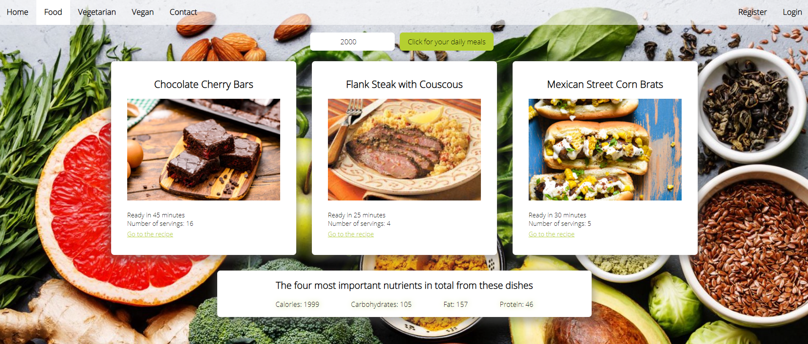

## App 'summer body'

### Table of Contents

1. Introduction
2. Problem
3. API keys
4. Starting the application
5. Unit test

### 1. Introduction

This frontend programming final assignment was created as a result of the Frontend Development course at NOVI University of Applied Sciences.

The project was set up with [Create React App](https://github.com/facebook/create-react-app).

### 2. Problem and solution

Summer is coming and we all want a beautiful, healthy body on the beach, but how do we do this? Besides working up a sweat at the gym, good nutrition is important. Taking in the right amount of calories each day will reduce fat and keep your body in good shape.

This app, after you enter the calories, provides three meals with the right amount of calories at the push of a button. How to make the meals, is on an external website linked to.

### 3. API keys

The API keys used for this project come from [Spoonacular](https://spoonacular.com/food-api/) and
[Firebase](https://firebase.google.com/firebase). These will be sent along in a separate file called `.env`. Registering can be done on the `register` page when you have started the application.
### 4. Starting the application

Once you have copied the project to your local machine, first install the `node_modules` by running the following commands in the terminal:

- `npm install`
- `npm install axios`
- `npm install react-router-dom`
- `npm install firebase`

When this is done, you can save the API keys from the `.env` file to the root of the project. In the terminal run the following:
- `npm run build`

You start the application by using:

- `npm start`

Open http://localhost:3000 to view the page in the browser.

### 5. Unit test

A unit test can be found in the directory `src/__test__` and run with:

`npm run test`